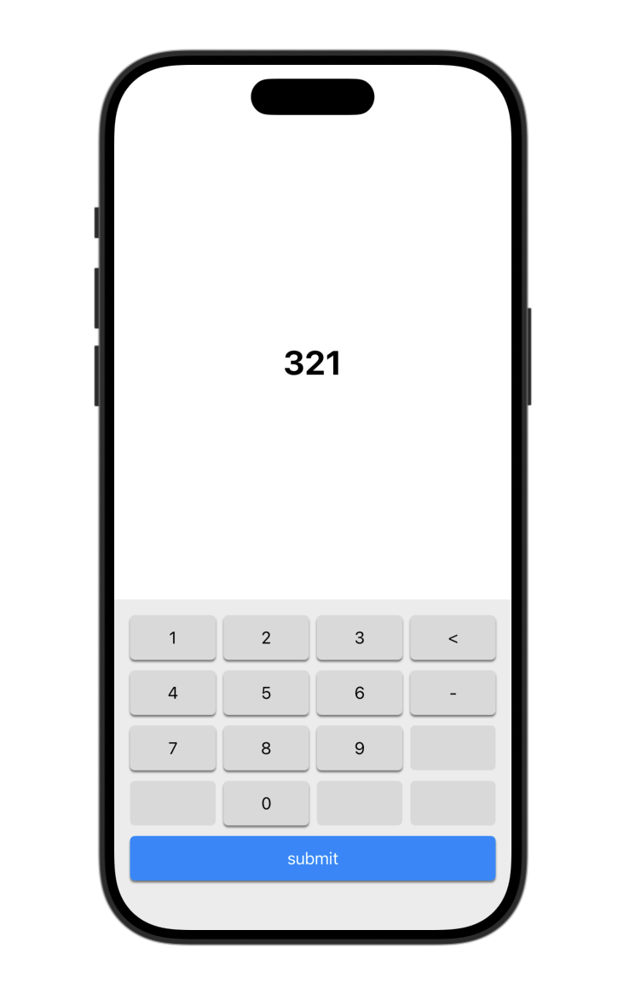
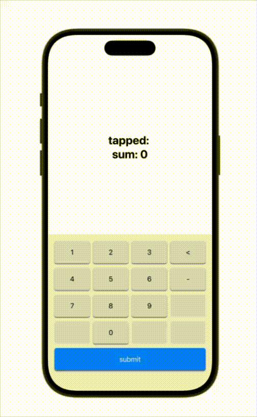

# NumberPadView
This is a swift package that provides a NumberPad UI and logic.
<!---->


# platform
- iOS18+
# Usage
If you use SPM (Swift Package Manager), then add this repository to your project, and import `NumberPad`
```Swift
import NumberPad
```
Sample Code
```Swift
import SwiftUI
import NumberPad

struct ContentView: View {
    @State private var text = ""
    @State private var sum = 0
    var body: some View {
        VStack {
            Spacer()
            Group {
                Text("tapped: \(text)")
                Text("sum: \(sum)")
            }
            .font(.title)
            .fontWeight(.bold)
            Spacer()
            NumberPadView($text) {
                sum += Int(text) ?? 0
                text = ""
            }
            .frame(maxWidth: .infinity, maxHeight: 350)
        }
    }
}
```
